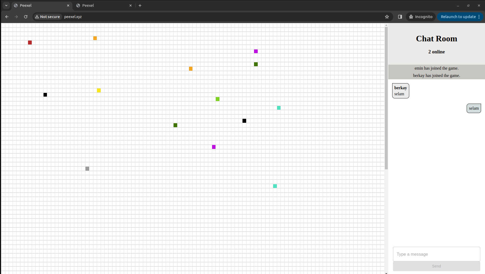

## Peexel

[peexel](http://peexel.xyz) is an interactive real-time pixel art game that allows users to collaboratively color a 100x100 pixel grid. Built with a modern tech stack, this project demonstrates the seamless integration of ReactJS for the frontend, Golang for the backend, Redis for efficient data management, and WebSockets for real-time communication.

#### Key Features:

- Real-Time Collaboration: Users can instantly see changes made by others, fostering a collaborative environment.
- Intuitive UI: The ReactJS frontend provides a smooth and responsive user experience.
- Scalable Backend: Golang powers the backend, ensuring high performance and concurrency handling.
- Efficient Data Management: Redis is used for fast and efficient data storage and retrieval.
- WebSocket Integration: Real-time updates are made possible through WebSocket technology.

#### Tech Stack:

* Frontend: ReactJS
* Backend: Golang
* Database: Redis
* Communication Protocol: WebSocket

#### Deployment

- The project is deployed on an AWS EC2(t3.micro) instance. [Domain](http://peexel.xyz) was purchased from namecheap.com.